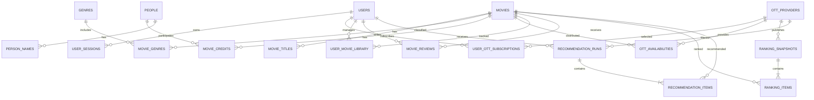

# 영화 추천 서비스 데이터베이스 설계

## 1. 문서 개요

이 문서는 다음 기능을 제공하는 영화 추천 서비스의 PostgreSQL 데이터베이스 설계를 정의한다.

- Google OAuth 기반 회원가입 및 로그인
- 영화 찜하기, 보는 중, 봤어요 상태 관리
- 사용자가 구독하는 OTT별 랭킹 및 추천
- 구독 OTT별 종료 예정작 및 공개 예정작 추천
- 영화 별점 및 리뷰
- 장르, 제목, 배우, 감독별 영화 검색
- 사용자 활동 기반 AI 영화 추천

### 설계 기준

- DBMS: PostgreSQL 16
- 기본 키: 확장성과 외부 노출 안전성을 고려해 UUID 사용
- 날짜 및 시간: 서버에는 `TIMESTAMPTZ`로 저장하고 화면에서 사용자 시간대로 변환
- 삭제 정책: 회원과 리뷰 등 사용자 데이터는 필요한 경우 소프트 삭제
- OTT 일정 상태: 시간이 지나면 변경되는 상태값을 저장하지 않고 공개일과 종료일로 계산

---

## 2. 핵심 ERD



---

## 3. 회원 및 Google 인증

### 3.1 `users`

회원의 기본 정보를 저장한다.

| 컬럼 | 타입 | 제약조건 | 설명 |
|---|---|---|---|
| `id` | UUID | PK | 회원 ID |
| `google_sub` | VARCHAR(255) | UNIQUE, NOT NULL | Google이 발급한 변경 불가능한 사용자 ID |
| `email` | CITEXT | UNIQUE, NOT NULL | Google 계정 이메일 |
| `nickname` | VARCHAR(50) | UNIQUE, NOT NULL | 닉네임 |
| `status` | VARCHAR(20) | NOT NULL | `ACTIVE`, `BLOCKED`, `WITHDRAWN` |
| `email_verified_at` | TIMESTAMPTZ | NULL | 이메일 인증 시점 |
| `last_login_at` | TIMESTAMPTZ | NULL | 마지막 Google 로그인 시점 |
| `created_at` | TIMESTAMPTZ | NOT NULL | 가입 시점 |
| `updated_at` | TIMESTAMPTZ | NOT NULL | 수정 시점 |
| `deleted_at` | TIMESTAMPTZ | NULL | 탈퇴 시점 |

Google 로그인 성공 후 ID 토큰의 서명, 발급자, 대상 서비스, 만료 시간을 검증하고 `sub` 값을 `google_sub`에 저장한다. 이메일은 변경될 수 있으므로 로그인 계정의 고유 식별자로 사용하지 않는다. Google 액세스 토큰과 비밀번호는 DB에 저장하지 않는다.

### 3.2 `user_sessions`

로그인 유지와 강제 로그아웃을 처리한다.

| 컬럼 | 타입 | 제약조건 | 설명 |
|---|---|---|---|
| `id` | UUID | PK | 세션 ID |
| `user_id` | UUID | FK, NOT NULL | 회원 ID |
| `refresh_token_hash` | VARCHAR(64) | UNIQUE, NOT NULL | 리프레시 토큰 해시 |
| `expires_at` | TIMESTAMPTZ | NOT NULL | 만료 시점 |
| `revoked_at` | TIMESTAMPTZ | NULL | 로그아웃 또는 강제 만료 시점 |
| `device_info` | JSONB | NULL | 기기 및 브라우저 정보 |
| `created_at` | TIMESTAMPTZ | NOT NULL | 생성 시점 |

---

## 4. OTT 구독

### 4.1 `ott_providers`

| 컬럼 | 타입 | 제약조건 | 설명 |
|---|---|---|---|
| `id` | SMALLSERIAL | PK | OTT ID |
| `code` | VARCHAR(30) | UNIQUE, NOT NULL | `NETFLIX`, `TVING`, `WAVVE` 등 |
| `name` | VARCHAR(50) | NOT NULL | 표시 이름 |
| `logo_url` | TEXT | NULL | 로고 주소 |
| `is_active` | BOOLEAN | NOT NULL | 서비스 사용 여부 |

### 4.2 `user_ott_subscriptions`

구독 이력을 보존하기 위해 구독 해제 시 행을 삭제하지 않고 종료 시점을 기록한다.

| 컬럼 | 타입 | 제약조건 | 설명 |
|---|---|---|---|
| `id` | UUID | PK | 구독 ID |
| `user_id` | UUID | FK, NOT NULL | 회원 ID |
| `provider_id` | SMALLINT | FK, NOT NULL | OTT ID |
| `started_at` | TIMESTAMPTZ | NOT NULL | 구독 시작 시점 |
| `ended_at` | TIMESTAMPTZ | NULL | 구독 종료 시점 |
| `created_at` | TIMESTAMPTZ | NOT NULL | 등록 시점 |

```sql
CHECK (ended_at IS NULL OR ended_at > started_at);

CREATE UNIQUE INDEX uq_active_user_ott
ON user_ott_subscriptions (user_id, provider_id)
WHERE ended_at IS NULL;
```

---

## 5. 영화, 장르, 배우 및 감독

### 5.1 `movies`

| 컬럼 | 타입 | 제약조건 | 설명 |
|---|---|---|---|
| `id` | UUID | PK | 영화 ID |
| `tmdb_id` | BIGINT | UNIQUE, NULL | 외부 영화 데이터 ID |
| `original_title` | VARCHAR(300) | NOT NULL | 원제 |
| `overview` | TEXT | NULL | 줄거리 |
| `release_date` | DATE | NULL | 극장 개봉일 |
| `runtime_minutes` | SMALLINT | NULL | 상영 시간 |
| `original_language` | VARCHAR(10) | NULL | 원어 코드 |
| `age_rating` | VARCHAR(20) | NULL | 관람 등급 |
| `poster_url` | TEXT | NULL | 포스터 주소 |
| `created_at` | TIMESTAMPTZ | NOT NULL | 생성 시점 |
| `updated_at` | TIMESTAMPTZ | NOT NULL | 수정 시점 |

### 5.2 `movie_titles`

한국어·영어 제목과 대체 제목을 저장해 다국어 검색을 지원한다.

| 컬럼 | 타입 | 제약조건 | 설명 |
|---|---|---|---|
| `id` | BIGSERIAL | PK | 제목 ID |
| `movie_id` | UUID | FK, NOT NULL | 영화 ID |
| `locale` | VARCHAR(10) | NOT NULL | `ko-KR`, `en-US` 등 |
| `title` | VARCHAR(300) | NOT NULL | 영화 제목 |
| `title_type` | VARCHAR(20) | NOT NULL | `PRIMARY`, `ORIGINAL`, `ALIAS` |

### 5.3 `genres`

| 컬럼 | 타입 | 제약조건 |
|---|---|---|
| `id` | SMALLSERIAL | PK |
| `code` | VARCHAR(30) | UNIQUE, NOT NULL |
| `name` | VARCHAR(50) | NOT NULL |

### 5.4 `movie_genres`

| 컬럼 | 타입 | 제약조건 |
|---|---|---|
| `movie_id` | UUID | PK, FK |
| `genre_id` | SMALLINT | PK, FK |

### 5.5 `people`

| 컬럼 | 타입 | 제약조건 | 설명 |
|---|---|---|---|
| `id` | UUID | PK | 인물 ID |
| `tmdb_id` | BIGINT | UNIQUE, NULL | 외부 인물 ID |
| `primary_name` | VARCHAR(200) | NOT NULL | 대표 이름 |
| `birth_date` | DATE | NULL | 생년월일 |

### 5.6 `person_names`

인물의 한글명, 영문명, 예명 등을 저장한다.

| 컬럼 | 타입 | 제약조건 |
|---|---|---|
| `id` | BIGSERIAL | PK |
| `person_id` | UUID | FK, NOT NULL |
| `locale` | VARCHAR(10) | NOT NULL |
| `name` | VARCHAR(200) | NOT NULL |
| `name_type` | VARCHAR(20) | NOT NULL |

### 5.7 `movie_credits`

| 컬럼 | 타입 | 제약조건 | 설명 |
|---|---|---|---|
| `id` | BIGSERIAL | PK | 크레딧 ID |
| `movie_id` | UUID | FK, NOT NULL | 영화 ID |
| `person_id` | UUID | FK, NOT NULL | 인물 ID |
| `credit_type` | VARCHAR(20) | NOT NULL | `ACTOR`, `DIRECTOR` |
| `character_name` | VARCHAR(200) | NULL | 배역명 |
| `billing_order` | SMALLINT | NULL | 출연진 표시 순서 |

배우 검색은 `credit_type = 'ACTOR'`, 감독 검색은 `credit_type = 'DIRECTOR'` 조건을 사용한다.

---

## 6. OTT 공개 및 종료 일정

### `ott_availabilities`

현재 공개작, 종료 예정작, 공개 예정작을 하나의 테이블에서 관리한다.

| 컬럼 | 타입 | 제약조건 | 설명 |
|---|---|---|---|
| `id` | UUID | PK | 제공 정보 ID |
| `movie_id` | UUID | FK, NOT NULL | 영화 ID |
| `provider_id` | SMALLINT | FK, NOT NULL | OTT ID |
| `region_code` | CHAR(2) | NOT NULL | 기본값 `KR` |
| `offer_type` | VARCHAR(20) | NOT NULL | `SUBSCRIPTION`, `FREE`, `RENT`, `BUY` |
| `available_from` | DATE | NOT NULL | OTT 공개 시작일 |
| `available_until` | DATE | NULL | OTT 제공 종료 시점 |
| `content_url` | TEXT | NULL | OTT 콘텐츠 페이지 |
| `source` | VARCHAR(50) | NULL | 데이터 출처 |
| `source_updated_at` | TIMESTAMPTZ | NULL | 출처의 갱신 시점 |
| `last_checked_at` | TIMESTAMPTZ | NOT NULL | 마지막 확인 시점 |

```sql
CHECK (
    available_until IS NULL
    OR available_until > available_from
);
```

`available_until`은 해당 날짜부터 이용할 수 없는 배타적 종료일로 통일한다.

### 제공 상태 계산

```sql
-- 현재 공개 중
available_from <= CURRENT_DATE
AND (
    available_until IS NULL
    OR available_until > CURRENT_DATE
)

-- 30일 이내 종료 예정
available_from <= CURRENT_DATE
AND available_until > CURRENT_DATE
AND available_until <= CURRENT_DATE + 30

-- 60일 이내 공개 예정
available_from > CURRENT_DATE
AND available_from <= CURRENT_DATE + 60
```

공개 여부를 `AVAILABLE`, `UPCOMING`, `EXPIRED` 같은 컬럼으로 저장하면 시간이 지난 후 값이 부정확해질 수 있으므로 날짜에서 계산한다.

---

## 7. 찜하기, 보는 중, 봤어요

### `user_movie_library`

| 컬럼 | 타입 | 제약조건 | 설명 |
|---|---|---|---|
| `user_id` | UUID | PK, FK | 회원 ID |
| `movie_id` | UUID | PK, FK | 영화 ID |
| `is_wishlisted` | BOOLEAN | NOT NULL | 찜 여부 |
| `watch_status` | VARCHAR(20) | NULL | `WATCHING`, `WATCHED` |
| `started_at` | TIMESTAMPTZ | NULL | 보기 시작한 시점 |
| `watched_at` | TIMESTAMPTZ | NULL | 다 본 시점 |
| `updated_at` | TIMESTAMPTZ | NOT NULL | 변경 시점 |

```sql
CHECK (
    watch_status IS NULL
    OR watch_status IN ('WATCHING', 'WATCHED')
);
```

`is_wishlisted`와 `watch_status`는 독립적인 값이다. 따라서 이미 본 영화를 계속 찜 목록에 보관하는 것도 가능하다.

---

## 8. 별점 및 리뷰

### `movie_reviews`

| 컬럼 | 타입 | 제약조건 | 설명 |
|---|---|---|---|
| `id` | UUID | PK | 리뷰 ID |
| `user_id` | UUID | FK, NOT NULL | 작성자 ID |
| `movie_id` | UUID | FK, NOT NULL | 영화 ID |
| `rating_half_steps` | SMALLINT | NOT NULL | 1~10 정수 |
| `content` | TEXT | NULL | 리뷰 내용 |
| `contains_spoiler` | BOOLEAN | NOT NULL | 스포일러 여부 |
| `created_at` | TIMESTAMPTZ | NOT NULL | 작성 시점 |
| `updated_at` | TIMESTAMPTZ | NOT NULL | 수정 시점 |
| `deleted_at` | TIMESTAMPTZ | NULL | 삭제 시점 |

```sql
UNIQUE (user_id, movie_id);
CHECK (rating_half_steps BETWEEN 1 AND 10);
```

`rating_half_steps`는 화면에서 2로 나눠 0.5~5.0점으로 표시한다. 정수로 저장하면 0.5 단위 별점을 오차 없이 처리할 수 있다.

---

## 9. OTT별 랭킹

### 9.1 `ranking_snapshots`

| 컬럼 | 타입 | 제약조건 | 설명 |
|---|---|---|---|
| `id` | UUID | PK | 랭킹 스냅샷 ID |
| `provider_id` | SMALLINT | FK, NOT NULL | OTT ID |
| `region_code` | CHAR(2) | NOT NULL | 국가 코드 |
| `ranking_date` | DATE | NOT NULL | 랭킹 기준일 |
| `ranking_type` | VARCHAR(30) | NOT NULL | `DAILY_POPULAR`, `WEEKLY_POPULAR` |
| `source` | VARCHAR(50) | NULL | 데이터 출처 |
| `collected_at` | TIMESTAMPTZ | NOT NULL | 수집 시점 |

```sql
UNIQUE (provider_id, region_code, ranking_date, ranking_type)
```

### 9.2 `ranking_items`

| 컬럼 | 타입 | 제약조건 | 설명 |
|---|---|---|---|
| `snapshot_id` | UUID | PK, FK | 스냅샷 ID |
| `movie_id` | UUID | PK, FK | 영화 ID |
| `rank` | SMALLINT | NOT NULL | 순위 |
| `score` | NUMERIC | NULL | 원본 랭킹 점수 |

```sql
UNIQUE (snapshot_id, rank)
```

랭킹을 영화 테이블에 직접 저장하지 않고 날짜별 스냅샷으로 보존해야 과거 순위와 순위 변화를 조회할 수 있다.

---

## 10. AI 추천

### 10.1 `recommendation_runs`

한 번 수행된 추천 작업의 조건과 모델 정보를 저장한다.

| 컬럼 | 타입 | 제약조건 | 설명 |
|---|---|---|---|
| `id` | UUID | PK | 추천 실행 ID |
| `user_id` | UUID | FK, NOT NULL | 추천 대상 회원 |
| `provider_id` | SMALLINT | FK, NULL | 특정 OTT로 제한할 때 사용 |
| `recommendation_type` | VARCHAR(30) | NOT NULL | `PERSONALIZED`, `ENDING_SOON`, `UPCOMING` |
| `model_name` | VARCHAR(100) | NOT NULL | 추천 모델 이름 |
| `feature_version` | VARCHAR(50) | NOT NULL | 입력 특성 버전 |
| `context` | JSONB | NULL | 추천 조건 및 필터 |
| `generated_at` | TIMESTAMPTZ | NOT NULL | 생성 시점 |
| `expires_at` | TIMESTAMPTZ | NOT NULL | 캐시 만료 시점 |

### 10.2 `recommendation_items`

| 컬럼 | 타입 | 제약조건 | 설명 |
|---|---|---|---|
| `run_id` | UUID | PK, FK | 추천 실행 ID |
| `movie_id` | UUID | PK, FK | 추천 영화 ID |
| `rank` | SMALLINT | NOT NULL | 추천 순위 |
| `score` | NUMERIC(8,6) | NOT NULL | 추천 점수 |
| `reason_text` | VARCHAR(500) | NULL | 사용자에게 표시할 추천 이유 |
| `reason_codes` | JSONB | NULL | 구조화된 추천 근거 |

```sql
UNIQUE (run_id, rank)
```

추천 모델의 입력 후보는 다음과 같다.

- 찜, 보는 중, 봤어요 상태
- 사용자가 등록한 별점
- 선호 장르, 배우, 감독
- 사용자가 구독 중인 OTT
- 현재 시청 가능한 영화
- 이미 본 영화 제외 여부
- 공개 예정 또는 종료 예정 여부

추천 근거는 AI가 작성한 문장뿐 아니라 구조화된 코드도 저장하는 것이 좋다.

```json
{
  "genres": ["SF", "스릴러"],
  "similar_movie_ids": ["영화 UUID"],
  "matched_actor_ids": ["배우 UUID"],
  "ending_soon": true
}
```

---

## 11. 검색 및 주요 인덱스

```sql
CREATE EXTENSION IF NOT EXISTS citext;
CREATE EXTENSION IF NOT EXISTS pg_trgm;

CREATE INDEX idx_movie_titles_search
ON movie_titles USING GIN (title gin_trgm_ops);

CREATE INDEX idx_person_names_search
ON person_names USING GIN (name gin_trgm_ops);

CREATE INDEX idx_movie_credits_person_type
ON movie_credits (person_id, credit_type, movie_id);

CREATE INDEX idx_movie_credits_movie_type
ON movie_credits (movie_id, credit_type, billing_order);

CREATE INDEX idx_movie_genres_genre
ON movie_genres (genre_id, movie_id);

CREATE INDEX idx_availability_provider_period
ON ott_availabilities
    (provider_id, region_code, offer_type, available_from, available_until);

CREATE INDEX idx_library_user_status
ON user_movie_library (user_id, watch_status);

CREATE INDEX idx_library_user_wishlist
ON user_movie_library (user_id)
WHERE is_wishlisted = TRUE;

CREATE INDEX idx_reviews_movie_active
ON movie_reviews (movie_id, created_at DESC)
WHERE deleted_at IS NULL;

CREATE INDEX idx_ranking_snapshot_lookup
ON ranking_snapshots
    (provider_id, region_code, ranking_type, ranking_date DESC);
```

한글 제목과 인물 이름의 부분 검색에는 PostgreSQL `pg_trgm`을 사용한다. 데이터 규모가 매우 커지거나 형태소 기반 검색이 필요해지면 OpenSearch의 Nori 분석기 도입을 고려한다.

---

## 12. 기능별 테이블 매핑

| 기능 | 중심 테이블 |
|---|---|
| Google 회원가입 및 로그인 | `users`, `user_sessions` |
| 구독 OTT 선택 | `ott_providers`, `user_ott_subscriptions` |
| 찜하기, 보는 중, 봤어요 | `user_movie_library` |
| OTT별 랭킹 | `ranking_snapshots`, `ranking_items` |
| 구독 OTT별 추천 | 구독 정보, 랭킹, 현재 OTT 제공 정보 |
| 종료 예정작 추천 | `ott_availabilities.available_until` |
| 공개 예정작 추천 | `ott_availabilities.available_from` |
| 별점 및 리뷰 | `movie_reviews` |
| 제목 검색 | `movie_titles` |
| 배우 및 감독 검색 | `people`, `person_names`, `movie_credits` |
| 장르 검색 | `genres`, `movie_genres` |
| AI 추천 | 사용자 활동, `recommendation_runs`, `recommendation_items` |

---

## 13. 핵심 비즈니스 규칙

1. 회원 계정은 검증된 Google `sub` 값을 기준으로 식별한다.
2. 한 회원은 같은 영화를 한 번만 평가하며 기존 평가를 수정한다.
3. 찜 여부와 시청 상태는 독립적으로 관리한다.
4. 한 회원은 같은 OTT에 활성 구독을 두 개 이상 가질 수 없다.
5. OTT 공개 상태는 저장하지 않고 공개 시작일과 종료일을 기준으로 계산한다.
6. OTT별 랭킹은 날짜별 스냅샷으로 저장한다.
7. 구독 OTT 추천에서는 `offer_type = 'SUBSCRIPTION'`인 영화만 기본 대상으로 한다.
8. AI 추천 결과를 그대로 영구 노출하지 않고 `expires_at` 이후 다시 생성한다.
9. 영화, 인물 및 OTT 데이터는 외부 API 수집 시 외부 ID를 기준으로 중복 생성을 방지한다.
10. 영화 이미지는 `movies.poster_url` 하나만 저장한다.
11. 사용자 탈퇴 시 개인정보는 삭제하거나 비식별화하고 관련 보존 정책을 별도로 정의한다.

---

## 14. 구현 우선순위

### 1단계: 핵심 기능

- `users`, `user_sessions`
- `movies`, `movie_titles`, `genres`, `movie_genres`
- `people`, `person_names`, `movie_credits`
- `ott_providers`, `ott_availabilities`
- `user_movie_library`, `movie_reviews`

### 2단계: OTT 개인화

- `user_ott_subscriptions`
- `ranking_snapshots`, `ranking_items`
- 종료 예정작 및 공개 예정작 조회

### 3단계: AI 추천

- `recommendation_runs`, `recommendation_items`
- 사용자 행동 기반 추천 모델
- 추천 결과 캐싱 및 추천 근거 제공
